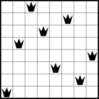
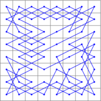

# CLP(FD) &mdash; Constraint Logic Programming over Finite Domains

CLP(FD), Constraint Logic Programming over Finite Domains, is
available in SWI-Prolog as
**[library(clpfd)](http://www.swi-prolog.org/man/clpfd.html)**.

This repository contains usage examples and tests of the library.

## Using CLP(FD) constraints

CLP(FD) is an instance of the general CLP(.) scheme, extending logic
programming with reasoning over specialised domains.

In the case of CLP(FD), the domain is the set of _integers_.

CLP(FD) constraints like
[`(#=)/2`](http://www.swi-prolog.org/pldoc/doc_for?object=%23%3D%20/%202),
[`(#\=)/2`](http://www.swi-prolog.org/pldoc/doc_for?object=%23%5C%3D%20/%202),
and
[`(#<)/2`](http://www.swi-prolog.org/pldoc/doc_for?object=%23%3C%20/%202)
are meant to be used as pure alternatives for lower-level arithmetic
primitives over integers. Importantly, they can be used in *all
directions*.

For example, we can use CLP(FD) constraints to obtain a version of
`n_factorial/2` that can be used as a true relation:

    :- use_module(library(clpfd)).

    n_factorial(0, 1).
    n_factorial(N, F) :-
            N #> 0,
            N1 #= N - 1,
            F #= N * F1,
            n_factorial(N1, F1).

This works in all directions, for example:

    ?- n_factorial(47, F).
    258623241511168180642964355153611979969197632389120000000000 ;
    false.

and also:

    ?- n_factorial(N, 1).
    N = 0 ;
    N = 1 ;
    false.

and also in the most general case:

    ?- n_factorial(N, F).
    N = 0,
    F = 1 ;
    N = F, F = 1 ;
    N = F, F = 2 ;
    N = 3,
    F = 6 .

## Example programs

This repository contains several example programs.

To get an idea of the power, usefulness and scope of CLP(FD)
constraints, I recommend you work through the examples in the
following order:

1. [**n_factorial.pl**](n_factorial.pl): Shows how to use CLP(FD)
   constraints for **declarative integer arithmetic**, obtaining very
   general programs that can be used in all directions.

2. [**sendmory.pl**](sendmory.pl) A simple cryptoarithmetic puzzle.
   The task is to assign one of the digits 0,...,9 to each of the
   letters S,E,N,D,M,O,R and Y in such a way that the following
   calculation is valid, and no leading zeroes appear:

            S E N D
          + M O R E
          ---------
        = M O N E Y

   This example illustrates several very important things:

   * It is the first example that shows **residual constraints** for the
     most general query. They are equivalent to the original query.

   * It is good practice to separate the **kernel relation** from
     `labeling/2`. See the [CLP(FD)
     documentation](http://www.swi-prolog.org/man/clpfd.html) for more
     information about this subject.

   * You can use this example to illustrate that the CLP(FD) system is able
     to **propagate** many things that can also be found with human
     reasoning. For example, due to the nature of the above calculation and
     the prohibition of leading zeroes, `M` is necessarily 1.

3. [**sudoku.pl**](sudoku.pl): Uses CLP(FD) constraints to model and solve
   a simple and well-known puzzle. This example is well suited for
   understanding the impact of different **propagation strengths**: Use it
   to compare
   [`all_different/1`](http://www.swi-prolog.org/pldoc/man?predicate=all_different/1)
   and
   [`all_distinct/1`](http://www.swi-prolog.org/pldoc/man?predicate=all_distinct/1)
   on different puzzles:

    

   The small dots in each cell indicate how many elements are pruned by
   different consistency techniques. In many Sudoku puzzles, using
   `all_distinct/1` makes labeling unnecessary.

4. [**magic_square.pl**](magic_square.pl): CLP(FD) formulation of [*magic
   squares*](http://mathworld.wolfram.com/MagicSquare.html). This is a good
   example to learn about **symmetry breaking** constraints: Consider how
   you can eliminate solutions that are rotations, reflections etc. of
   other solutions, by imposing suitable further constraints.

5. [**magic_hexagon.pl**](magic_hexagon.pl): Generate solutions for the
   [*magic hexagon*](http://mathworld.wolfram.com/MagicHexagon.html) of
   order 3. The task is to place the integers 1,...,19 in the following
   grid so that the sum of all numbers in a straight line (there are lines
   of length 3, 4 and 5) is equal to 38. One solution of this task is shown
   in the right picture:

    

   This is an example of a task that looks very simple, yet is almost
   impossibly hard to solve manually. It is easy to solve with CLP(FD).

6. [**n_queens.pl**](n_queens.pl): Model the so-called [*N-queens
   puzzle*](https://en.wikipedia.org/wiki/Eight_queens_puzzle) with CLP(FD)
   constraints. This example is a good candidate to experiment with
   different **search strategies**, specified as options of
   [`labeling/2`](http://www.swi-prolog.org/pldoc/man?predicate=labeling/2).
   For example, using the labeling strategy `ff`, you can easliy find
   solutions for 100 queens and more. Sample solutions for 8 and 50 queens:

    

7. [**knight.pl**](knight.pl): Closed Knight's Tour using CLP(FD)
   constraints. This is an example of using a more complex **global
   constraint** called
   [`circuit/1`](http://www.swi-prolog.org/pldoc/man?predicate=circuit/1).
   Sample solutions, using an 8x8 and a 16x16 board:

     

## Animations

If you are teaching Prolog and CLP(FD) constraints, it is very useful
to show *animations* of search processes. An instructional example:

[**N-queens animation**](http://www.metalevel.at/queens/): This
visualizes the search process for the N-queens example.

You can use similar [PostScript
instructions](http://www.metalevel.at/postscript/animations.html) to
create custom animations for other examples.

## Propagation strength of CLP(FD) constraints

Since integer arithmetic is in general *undecidable*, CLP(FD)
constraints are necessarily *incomplete*. This means that you cannot,
in general, take the fact that a CLP(FD) constraint *succeeds* as an
indication that there are any solutions. Therefore, you need to use
[`call_residue_vars/2`](http://www.swi-prolog.org/pldoc/man?predicate=call_residue_vars/2)
to see if any constraints are still pending. For example:

    :- use_module(library(clpfd)).

    declarative_false :-
            X #< Y,
            Y #< X.

With the above program, we get:

    ?- declarative_false.
    true.

however, it is in fact `false`, because there are no solutions! The
toplevel has omitted important constraints that are still pending. You
can make them visible by wrapping the goal in `call_residue_vars/2`:

    ?- call_residue_vars(declarative_false, Vs).
    Vs = [X1, X2],
    X1#=<X2+ -1,
    X2#=<X1+ -1.

There is a solution only if you can satisfy these residual goals.

## SICStus compatibility

I am aiming for compatibility with the CLP(FD) system of SICStus
Prolog. All examples work with at most small changes with SICStus
Prolog too. For example, instead of `(ins/2)`, you need to use
`domain/3` in SICStus Prolog.

For better performance, I highly recommend you obtain a copy of
SICStus Prolog, and use it to solve more serious tasks with CLP(FD).

## Acknowledgments

I am extremely grateful to:

[**Tom Schrijvers**](http://people.cs.kuleuven.be/~tom.schrijvers/),
who has generously contributed several important constraint libraries
to SWI-Prolog
([`dif/2`](http://www.swi-prolog.org/pldoc/man?predicate=dif/2)!!),
and from whom I learned a lot.

[**Ulrich Neumerkel**](http://www.complang.tuwien.ac.at/ulrich/), who
introduced me to constraint logic programming and was the first and
most determined tester of my library, filing hundreds of comments. If
you are teaching Prolog, I recommend you check out his [GUPU
system](http://www.complang.tuwien.ac.at/ulrich/gupu/).

[**Nysret Musliu**](http://dbai.tuwien.ac.at/staff/musliu/), my thesis
advisor, whose interest in combinatorial tasks and constraint
satisfaction highly motivated me to work in this area.

[**Mats Carlsson**](https://www.sics.se/~matsc/), the designer and main
implementor of SICStus Prolog and its superb [CLP(FD)
library](https://sicstus.sics.se/sicstus/docs/latest4/html/sicstus.html/lib_002dclpfd.html#lib_002dclpfd).
For any serious use of CLP(FD) constraints, make sure to check out his
elegant and fast system.
